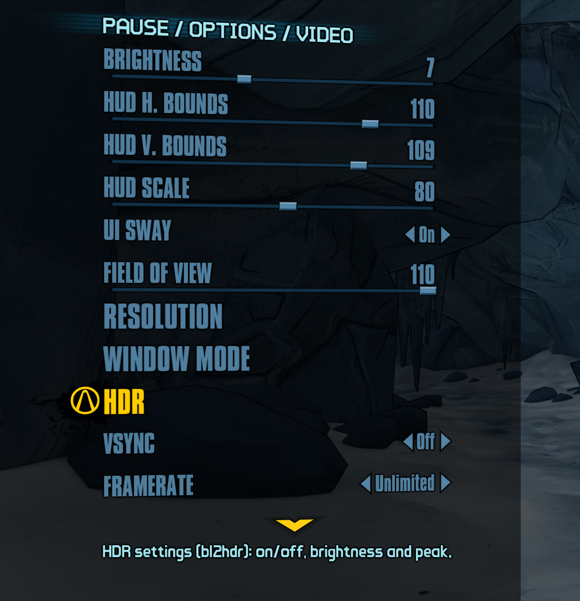
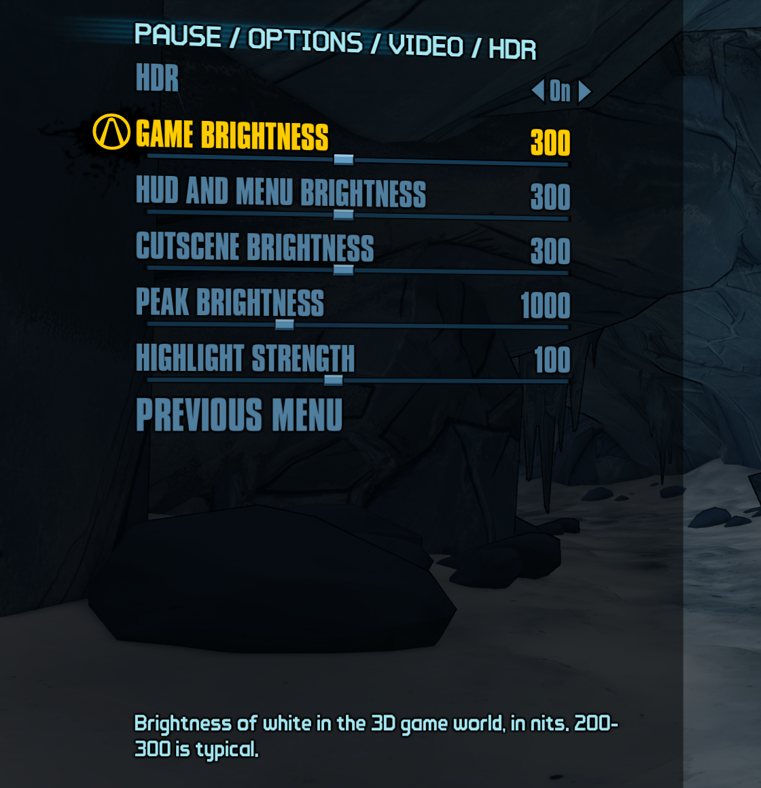

# Borderlands 2 — Native HDR (bl2hdr)

[](https://github.com/raspy-corroded3/borderlands2-native-hdr/blob/badges/VIRUSTOTAL.md)

A drop-in `d3d9.dll` that adds **real HDR output** to Borderlands 2 (PC, Steam), with an
**HDR settings page in the game's own Video menu**. No ReShade, no mod manager.

- The game's tonemapper is replaced by an HDR version that keeps the original look up to SDR white and
  lets highlights (sun, sky, fire, muzzle flashes) go brighter, up to your display's peak.
- Output is native Windows HDR (scRGB, FP16 swapchain) — Windows Auto HDR is not involved.
- Separate brightness for the 3D scene, the HUD/menus and cutscenes.
- **Options → Video → HDR**: HDR on/off and sliders for every brightness, the peak and the highlight
  strength. Changes apply live and are saved to `bl2hdr.ini`.
- A built-in peak-brightness test pattern to match your display.

> **Status: beta (1.0.1-beta.1).** Tested on one system (Windows 11, NVIDIA RTX 3070 Ti, Samsung
> Odyssey G6 HDR600). Reports from other hardware are very welcome — open an issue with your GPU,
> driver, display and `bl2hdr.log` (from `Binaries\Win32`).

## Screenshots
| Options → Video: the **HDR** row, below Window Mode | The HDR settings page |
|---|---|
|  |  |

## Requirements
- Borderlands 2 for Windows (Steam, game version 1.0.257.2863302; other versions untested).
- Windows 10/11 with **HDR enabled** (Settings → System → Display → Use HDR).
- A GPU and driver with Direct3D 12 (D3D9on12 is part of Windows).
- Not compatible with DXVK or ReShade's DirectX 9 mode at the same time (both also replace `d3d9.dll`).

## Install
1. Download `d3d9.dll` and `bl2hdr.ini` from the [Releases](../../releases) page (or build them, below).
2. Copy both into `Borderlands 2\Binaries\Win32\` (next to `Borderlands2.exe`).
   If a `d3d9.dll` from another mod is already there, move it away first.
3. Start the game. In **Options → Video**, the **HDR** row (below Window Mode) opens the HDR settings.

To uninstall, delete `d3d9.dll` and `bl2hdr.ini` (and `bl2hdr.log`) from that folder.

The game is switched from exclusive fullscreen to a borderless window automatically (required for the
HDR output). Alt-tab works instantly.

## Settings (`bl2hdr.ini`)
| Setting | Default | Meaning |
|---|---|---|
| `[hdr] Enabled` | 1 | HDR on/off (also set from the Video menu) |
| `[hdr] PaperWhiteNits` | 203 | Brightness of SDR white in the 3D scene. 200–300 is typical. |
| `[hdr] UIWhiteNits` | = PaperWhiteNits | Brightness of the HUD, menus and loading screens |
| `[hdr] VideoWhiteNits` | = UIWhiteNits | Brightness of cutscenes (Bink videos) |
| `[hdr] PeakNits` | 1000 | Your display's peak (use the test pattern below) |
| `[hdr] Strength` | 1.0 | How far highlights extend (0 = SDR look, up to 2) |
| `[hdr] TestPattern` | 0 | 1 = show the peak-brightness test pattern instead of the game |
| `[hdr] DebugHighlights` | 0 | 1 = paint everything brighter than SDR white magenta |
| `[display] ForceBorderless` | 1 | Turn exclusive fullscreen into a borderless window |
| `[menu] HdrOption` | 1 | Add the HDR settings row to the Video menu |
| `[menu] GameHooks` | 1 | Master switch for the game-script hooks (the menu option needs them) |
| `[d3d9] OnDeviceRemoved` | message | If the graphics driver crashes or resets: `message` = explain and close the game, `exit` = close without a message, `continue` = leave it (the game hangs) |

Edit the file while the game is closed. All keys are documented in the shipped `bl2hdr.ini`.

### Finding your display's peak
Set `TestPattern=1` and start the game. You see 16 tiles; each has a bright outer square (always at
your display's maximum) and an inner square at 300, 350 … 1050 nits (left to right, top to bottom).
The **last tile where the inner square is still visible** is your peak: put that value in `PeakNits`,
set `TestPattern=0`, and close the pattern with Alt+F4.

## How it works (short)
The game runs on Direct3D 9. bl2hdr loads as the game's `d3d9.dll` and:
1. runs the game's D3D9 on top of Direct3D 12 (**D3D9on12**, part of Windows), which gives access to
   the rendered frames as D3D12 resources;
2. hands the game a 16-bit float back buffer instead of the 8-bit one, so values above 1.0 survive;
3. replaces the final tonemap shader (identified by the CRC32 of its bytecode) with an HDR version
   that keeps the original curve and colour grade below SDR white and extends the highlights;
4. presents the frame through **its own** DXGI FP16 scRGB swapchain with a small D3D12 encode pass;
5. hooks the game's UnrealScript engine (ProcessEvent / CallFunction) to add the HDR settings page to the
   Video menu (a page object of the game's own options class, created with StaticConstructObject).

Full details: [docs/ARCHITECTURE.md](docs/ARCHITECTURE.md).

## Building
Requirements: Visual Studio 2022 or 2026 (Build Tools are enough) with the C++ workload, which includes
the Windows SDK (`fxc`), CMake and Ninja.
```
build.cmd Release        :: from cmd, or: cmd /c build.cmd Release   from Git Bash
```
Output: `build\Release\d3d9.dll` (32-bit, static CRT, only depends on KERNEL32). Copy it with
`dist\bl2hdr.ini` into `Binaries\Win32` to test. Shaders in `shaders/` are compiled by the build and
embedded in the DLL.

When modifying: keep the DLL 32-bit with no new runtime dependencies, never commit game files or
anything extracted from the game, and keep failures non-fatal (log and fall back to the game's own
behaviour, as `output_dxgi.cpp` does). For debugging, `[debug] LogShaders=1` and `StatsIntervalSec=10`
add detail to `bl2hdr.log`.

## Contributing
Contributions are welcome — bug reports, test results on other hardware, and pull requests.
- **Problems:** open an issue with your GPU, driver version, display, whether Windows HDR is on, the
  game version, what happened, and `bl2hdr.log` from `Binaries\Win32` (copy it right after the problem;
  it is rewritten every launch).
- **Changes:** fork, create a branch, and open a pull request describing what changed and how you tested
  it in game. CI builds every pull request.
- **Rules:** no game code, assets or anything extracted from the game (shaders, packages, decompiled
  code); facts such as offsets, byte patterns or shader CRCs are fine. Keep the DLL 32-bit with no new
  runtime dependencies, and match the existing code style.
- The [To do](#to-do) list below is a good place to start.
- Security problems: please report them privately — see [SECURITY.md](SECURITY.md). Everyone taking part
  is expected to follow the [Code of Conduct](CODE_OF_CONDUCT.md).

Releases are built by GitHub Actions from a version tag (`.github/workflows/release.yml`), with SHA-256
checksums and a build attestation (see [SECURITY.md](SECURITY.md) to verify a download). The published files
are then scanned on VirusTotal automatically (`.github/workflows/virustotal.yml`): the result is in each
release's notes and in the badge at the top of this page.

## Known issues
- **"Ran out of video memory" after long sessions.** BL2 is a 32-bit game and 9on12 uses about 300 MiB more
  of its 4 GiB address space than plain D3D9, so the game can stop with this message even though the GPU has
  plenty left. If that happens, lower the texture pool in
  `Documents\My Games\Borderlands 2\WillowGame\Config\WillowEngine.ini`: `[TextureStreaming]`
  `PoolSize=256` (instead of 512 or higher).
- **Graphics driver crash or reset (TDR).** 9on12 cannot recover the GPU device, so bl2hdr shows a message
  and closes the game instead of leaving it frozen. Progress since the last save point is lost. Plain D3D9
  (`[d3d9] Mode=native`, no HDR) does not have this limit.
- **Cutscenes stay SDR.** The Bink videos themselves are SDR: they look like the original game, with white
  at `VideoWhiteNits` (Cutscene brightness).

## To do
- Test on AMD and Intel GPUs and on laptops with two GPUs (so far only tested on NVIDIA). Reports welcome.
- Test more of the DLC maps (so far: the base game and a few DLC maps).
- Optional "full off" setting: start without the HDR output at all (today HDR Off keeps the HDR pipeline
  and gives the SDR look).
- Optional on/off setting for the cel-shading outlines.
- Use less of the game's 32-bit address space, to remove the "ran out of video memory" issue above.
- Other platforms (bl2hdr is Windows-only today):
  - **Linux via Proton/Wine** (including the Steam Deck): the game-side parts (tonemap, cutscene fix, HDR
    menu) work as they are, but the HDR output needs a new path through DXVK and Vulkan, because Wine has no
    D3D9on12. HDR on Linux also needs an HDR-capable desktop (e.g. gamescope or KDE Plasma on Wayland).
  - **macOS (Apple Silicon)**: the Windows version of Borderlands 2 runs through Wine-based compatibility
    layers (reported working on an M2 MacBook Air with macOS 27). bl2hdr's HDR output depends on the layer
    passing HDR through to macOS, which isn't possible today; at best the menu and tonemap would work with
    SDR output.
- Lighting and reflections in HDR (ideas, to explore):
  - HDR intensity for dynamic lights: adjust the game's separate per-light passes (point, spot, directional).
    Expected cost: negligible.
  - Brighter reflections and shine in HDR: BL2's reflections are pre-made cubemaps sampled inside each
    material, so this means patching material shaders as the game creates them. Expected cost: negligible.
  - Screen-space reflections as a new pass: an experiment only. Roughly 0.5-2 ms per frame at 1440p, and
    BL2 has no normal buffer (normals would be reconstructed from depth).

## Credits and licence
MIT licence — see [LICENSE](LICENSE). Third-party references and credits:
[THIRD_PARTY_NOTICES.md](THIRD_PARTY_NOTICES.md). Borderlands 2 is © Gearbox Software / 2K; this project
contains no game code or assets and requires a legally owned copy of the game.
